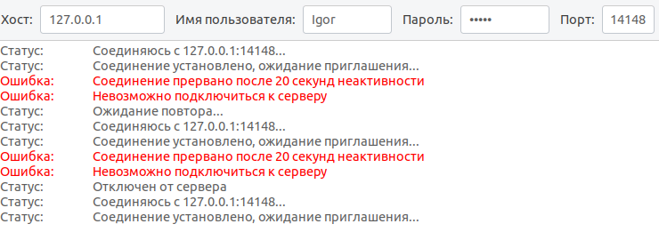

# Практика 6. Транспортный уровень

## Wireshark: UDP (5 баллов)
Начните захват пакетов в приложении Wireshark и затем сделайте так, чтобы ваш хост отправил и
получил несколько UDP-пакетов (например, с помощью обращений DNS).
Выберите один из UDP-пакетов и разверните поля UDP в окне деталей заголовка пакета.
Ответьте на вопросы ниже, представив соответствующие скрины программы Wireshark.

#### Вопросы
1. Выберите один UDP-пакет. По этому пакету определите, сколько полей содержит UDP-заголовок.

UDP-заголовок содержит 5 полей:
- Source Port
- Destination Port
- Length
- Checksum
- UDP playload (данные)

2. Определите длину (в байтах) для каждого поля UDP-заголовка, обращаясь к отображаемой
   информации о содержимом полей в данном пакете.

Каждое поле в занимает 2 байта.

3. Значение в поле Length (Длина) – это длина чего?
   
Поле Length указывает общую длину UDP-пакета c заголовоком и данными.

4. Какое максимальное количество байт может быть включено в полезную нагрузку UDP-пакета?
   
Максимальная длина поля Length — 2 байта, что даёт максимальное значение 65535.
То есть больше 65535 байт мы перенести не сможем, кроме того вычитаем из этого длину заголовка и получаем:
65535 - 8 = 65527 байт

5. Чему равно максимально возможное значение номера порта отправителя?

Номер порта — 16-битное число, поэтому максимальное значение = 65535

6. Какой номер протокола для протокола UDP? Дайте ответ и для шестнадцатеричной и
   десятеричной системы. Чтобы ответить на этот вопрос, вам необходимо заглянуть в поле
   Протокол в IP-дейтаграмме, содержащей UDP-сегмент.

В десятичном виде - 17.

В шестандатеричном - 0x11

7. Проверьте UDP-пакет и ответный UDP-пакет, отправляемый вашим хостом. Определите
   отношение между номерами портов в двух пакетах.

В реквестах dst port всегда выставляется равным 53, src port выдаётся клиенту динамически.

Request:

Response:

## Программирование. FTP

### FileZilla сервер и клиент (3 балла)
1. Установите сервер и клиент [FileZilla](https://filezilla.ru/get)
2. Создайте FTP сервер. Например, по адресу 127.0.0.1 и портом 21. 
   Укажите директорию по умолчанию для работы с файлами.
3. Создайте пользователя TestUser. Для простоты и удобства можете отключить использование сертификатов.
4. Запустите FileZilla клиента (GUI) и попробуйте поработать с файлами (создать папки,
добавить/удалить файлы).

Приложите скриншоты.

#### Скрины

### FTP клиент (3 балла)
Создайте консольное приложение FTP клиента для работы с файлами по FTP. Приложение может
обращаться к FTP серверу, созданному в предыдущем задании, либо к какому-либо другому серверу 
(есть много публичных ftp-серверов для тестирования, [вот](https://dlptest.com/ftp-test/) один из них).

Приложение должно:
- Получать список всех директорий и файлов сервера и выводить его на консоль
- Загружать новый файл на сервер
- Загружать файл с сервера и сохранять его локально

Бонус: Не используйте готовые библиотеки для работы с FTP (например, ftplib для Python), а реализуйте решение на сокетах **(+3 балла)**.

#### Демонстрация работы

Будем проверять на публичном сервере `ftp.dlptest.com`.

Мы подключимся к серверу, загрузим на него файл `example.txt`, а потом его же и скачаем сервера.
Файл `example.txt` выглядит так:

1) Подключаемся к серверу и получаем список директорий и файлов

Видимо множество файлов

2) Загружаем наш `example.txt`

3) Скачиваем обратно загруженный файл

Видим, что скачивание успешно:

И в нашей директории появился новый файл:

4) Подключимся снова к серверу и посмотрим, есть ли там наш файл

На сервере мы сохраняли файл как `uploaded.txt`:

Видим, что наш `uploaded.txt` в списке файлов сервера:

### GUI FTP клиент (4 балла)
Реализуйте приложение FTP клиента с графическим интерфейсом. НЕ используйте C#.

Возможный интерфейс:

<images/img src="images/example-ftp-gui.png" width=300 />

В приложении должна быть поддержана следующая функциональность:
- Выбор сервера с указанием порта, логин и пароль пользователя и возможность
подключиться к серверу. При подключении на экран выводится список всех доступных
файлов и директорий
- Поддержаны CRUD операции для работы с файлами. Имя файла можно задавать из
интерфейса. При создании нового файла или обновлении старого должно открываться
окно, в котором можно редактировать содержимое файла. При команде Retrieve
содержимое файла можно выводить в главном окне.

#### Демонстрация работы

1) Запускаем приложение и подключаемся к удалённому серверу

2) Создаём новый файл

3) Смотрим содержимое файла

### FTP сервер (5 баллов)
Реализуйте свой FTP сервер, который работает поверх TCP сокетов. Вы можете использовать FTP клиента, реализованного на прошлом этапе, для тестирования своего сервера.
Сервер должен реализовать возможность авторизации (с указанием логина/пароля) и поддерживать команды:
- CWD
- PWD
- PORT
- NLST
- RETR
- STOR
- QUIT

#### Демонстрация работы
todo
